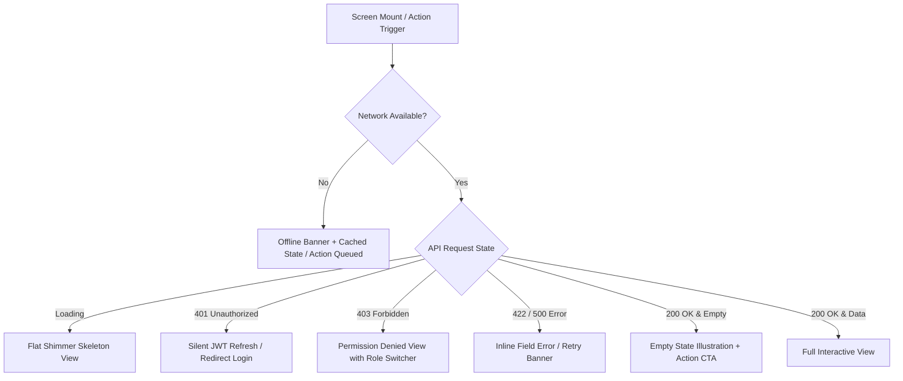

# 🎨 Comprehensive Master UI/UX Frontend Plan & Implementation Checklist

> **Architectural & Design Standard**: Built with **React Native + Expo SDK 57 (TypeScript)** and **Expo Router** targeting Web, iOS, and Android. Conforms to strict **Flat Design Aesthetics** (2D minimalism, bold solid colors, crisp geometric borders, 0 gradients, 0 box-shadows) and **YAGNI**, **DRY**, **KISS**, **SOLID**, and **SSOT** principles.

---

## 📐 1. Design System & Visual Architecture

### 🎨 Color Palette & Tokens Reference (`frontend/src/theme/tokens.ts`)
- **Primary**: Solid Royal Blue (`#2563EB`)
- **Secondary**: Solid Emerald Green (`#059669`)
- **Accent Orange**: Solid Vibrant Orange (`#EA580C`)
- **Accent Red**: Solid Emergency Red (`#DC2626`)
- **Accent Purple**: Solid Deep Purple (`#7C3AED`)
- **Surfaces**: Crisp White (`#FFFFFF`) / Dark Slate (`#0F172A` & `#1E293B`)
- **Borders**: 2px Solid Flat Border (`#CBD5E1` Light / `#334155` Dark / `#2563EB` Active)
- **Shadows**: `none` (`shadowOpacity: 0`, `elevation: 0`)

---

## 🛡️ 2. Comprehensive UX Error & Edge Case Framework

Every screen and user flow MUST handle the following 6 core states natively:

### Edge Case Design Rules
1. **Network Disconnection**: Display top flat banner (`#EA580C`). Queue write actions locally (Outpass check-in, SOS alerts, Attendance scans) and flush automatically upon reconnection.
2. **Empty Data States**: No plain blank screens. Every list view MUST render a custom flat icon, friendly title, descriptive explanation, and a primary action button (e.g. *"No outpasses found" -> "Request Outpass"*).
3. **Form Validation Errors**: Instant client-side check on blur + clear inline red error messages below input fields with crisp 2px red border highlight (`#DC2626`).
4. **Session & Role Expiry**: Handle 401 response globally via Axios/Fetch interceptor. Prompt user with a non-blocking modal before auto-redirecting to `/login`.
5. **Slow Connections**: Replace layout with 2D flat skeleton placeholders matching exact element dimensions during loading (> 300ms).

---

## 📋 3. Master Screen-by-Screen Implementation Checklist

### 🚀 Phase 1: Authentication & Onboarding Flow (`app/(auth)/`)
- [x] **1.1 Public College Landing Page (`app/index.tsx`)**
  - [x] Sticky top navigation bar with brand logo, Quick Search, and Login CTA
  - [x] Hero section with flat 2D campus illustration and dual CTAs ("Explore Admissions", "Student Portal")
  - [x] Live statistics counters (Students, Faculty, Placements, Campus Acreage)
  - [x] Feature highlights grid (Smart Attendance, Outpass Gatekeeper, Hostel & Mess)
  - [x] Testimonial slider and accreditation badges
  - [x] Responsive footer with emergency helpline links and legal terms
- [x] **1.2 Sign In & Security Authentication (`app/(auth)/login.tsx`)**
  - [x] Toggle tabs for Email / Phone + Password vs Quick OTP Login
  - [x] Floating label inputs with show/hide password toggle
  - [x] "Forgot Password?" flow modal with OTP verification
  - [x] Edge case: Invalid credentials feedback with remaining attempt counter
- [x] **1.3 Public Self-Signup & OTP Verification (`app/(auth)/register.tsx`)**
  - [x] Step 1: Basic info collection (Full Name, Email/Phone, Password)
  - [x] Step 2: 6-digit OTP entry with auto-focus inputs and resend timer cooldown (60s)
  - [x] Step 3: Account creation success state transitioning status to `registered`
- [x] **1.4 Role Application & Status Tracker (`app/(auth)/role-selection.tsx`)**
  - [x] Requestable role cards (Student, Faculty, Warden, Parent) with required evidence guidelines
  - [x] Claimed identifier entry (Student Admission No / Employee ID / Hostel Wing)
  - [x] ID card / document upload picker with image preview and size check (< 5MB)
  - [x] Real-time application tracker timeline (`pending` -> `under_review` -> `approved` / `needs_info` / `rejected`)
  - [x] Resubmit / edit request view for `needs_info` status
- [x] **1.5 Parent-Child Linking Request Wizard (`app/(auth)/parent-link.tsx`)**
  - [x] Child lookup form (Student Admission Number + Date of Birth verification)
  - [x] Relationship selector (Father / Mother / Guardian)
  - [x] Confirmation status card showing live student approval state

---

### 🎛️ Phase 2: Shared Shell, Navigation & Platform Utilities (`app/(tabs)/`)
- [x] **2.1 Universal Header & Active Role Switcher Drawer**
  - [x] Header displaying current operational role badge and unread notification badge count
  - [x] Multi-role switcher modal/drawer (e.g. Switch between Faculty & Warden personas)
  - [x] Quick dark/light mode toggle switch
- [x] **2.2 Omnichannel Notification Center (`app/notifications.tsx`)**
  - [x] Filter tabs: All, Academic Alerts, Outpass Updates, Safety/SOS
  - [x] Mark all as read button and swipe-to-dismiss notification items
  - [x] Click-through deep linking to corresponding detail screens
- [x] **2.3 Floating Emergency SOS Trigger Button (`src/components/SOSButton.tsx`)**
  - [x] Persistent bottom-right floating 2D emergency red action button
  - [x] Press-and-hold (3 seconds) or shake gesture confirmation modal
  - [x] Active SOS banner with live location broadcast and cancellation button
- [x] **2.4 Dynamic QR Code Scanner & Presenter Modal (`src/components/QRModal.tsx`)**
  - [x] Digital Student ID / Outpass QR code generator with dynamic timestamp payload
  - [x] Camera QR Scanner overlay with flashlight toggle for Warden gatekeepers and Faculty attendance

---

### 🎓 Phase 3: Student Experience Portal (`app/(student)/`)
- [x] **3.1 Student Home Dashboard (`app/(student)/index.tsx`)**
  - [x] Welcome header with current academic term, batch name, and Quick Action bar
  - [x] Today's class schedule carousel with real-time room & period indicators
  - [x] Attendance gauge chart per subject with low attendance (< 75%) warning banner
  - [x] Quick digital outpass status pill and pending fee dues notification card
- [x] **3.2 Timetable & Class Schedule (`app/(student)/timetable.tsx`)**
  - [x] Day selector bar (Mon-Sat) with period slot list
  - [x] Class status badges (Scheduled, In-Progress, Cancelled, Room Changed)
  - [x] Syllabus link and faculty contact drawer
- [x] **3.3 Subject Attendance & Dispute Manager (`app/(student)/attendance.tsx`)**
  - [x] Cumulative & subject-wise attendance breakdown
  - [x] Interactive session log (Present, Absent, Late, On-Leave)
  - [x] "Dispute Attendance" modal with reason text and proof attachment
  - [x] Live QR Scanner button to scan faculty's rotating class attendance code
- [x] **3.4 Digital Outpass Request & Pass Screen (`app/(student)/outpass.tsx`)**
  - [x] Outpass application form (Category: Local / Overnight / Emergency, Reason, Leaving Time, Return Time)
  - [x] Multi-level approval status timeline (Parent -> Warden -> Gate Security)
  - [x] Digital Outpass Pass Card with dynamic QR code for guard gate scan
  - [x] "Mark Return" check-in button with geofence validation
- [x] **3.5 Fee Invoices & Payment Portal (`app/(student)/fees.tsx`)**
  - [x] Pending dues summary card with itemized breakdown (Tuition, Hostel, Mess, Library Fines)
  - [x] Payment Gateway integration modal with UPI, Net Banking, and Card options
  - [x] Payment history table with downloadable PDF receipts
- [x] **3.6 Library Catalog & Book Loan Tracker (`app/(student)/library.tsx`)**
  - [x] Library book search bar with filters (Title, Author, ISBN, Availability)
  - [x] Issued books list with due date countdown badges and renewal request button
  - [x] Overdue fine calculation preview card
- [x] **3.7 Hostel Room & Mess Operations (`app/(student)/hostel.tsx`)**
  - [x] Room details card (Building, Room No, Bed ID, Roommates)
  - [x] Room maintenance issue ticket logger with image upload
  - [x] Weekly Mess Menu schedule (Breakfast, Lunch, Snacks, Dinner)
  - [x] Daily meal rating & feedback form
- [x] **3.8 Campus Clubs, Events & Placements (`app/(student)/campus.tsx`)**
  - [x] Student clubs directory with "Join Request" CTA
  - [x] Upcoming campus events feed with 1-tap registration
  - [x] Placement drives portal (Company profile, Role, CGPA eligibility, "Apply Now" button)
  - [x] Earned certificates & digital awards locker
- [x] **3.9 Digital Student ID Card (`app/(student)/id-card.tsx`)**
  - [x] Front/Back rotatable flat ID Card view
  - [x] Offline verification QR payload containing encrypted student code and validity

---

### 🏢 Phase 4: Warden Operations Console (`app/(warden)/`)
- [x] **4.1 Warden Dashboard & Priority Inbox (`app/(warden)/index.tsx`)**
  - [x] Metrics cards: Pending Outpasses, Active SOS Incidents, Vacant Beds, Overdue Students
  - [x] Quick action bar for Roll Call and Visitor Passes
- [x] **4.2 Outpass Approval Inbox (`app/(warden)/outpasses.tsx`)**
  - [x] Outpass queue filtered by status (`pending_warden`, `overdue`, `approved`)
  - [x] Student profile drawer with guardian contact and past attendance record
  - [x] Quick Approve / Reject modal with custom remark entry
- [x] **4.3 Emergency SOS Control Room (`app/(warden)/sos.tsx`)**
  - [x] Real-time flashing emergency incident list with student location coordinates
  - [x] "Acknowledge Incident" and "Dispatch Assistance" action buttons
  - [x] Escalation tracker showing notified security and hostel staff
  - [x] Incident Closure report logger
- [x] **4.4 Hostel Room & Bed Allocator (`app/(warden)/rooms.tsx`)**
  - [x] Interactive Hostel Floor & Room Map grid
  - [x] Vacant bed filter and student bed allocation modal
  - [x] Room transfer approval queue
- [x] **4.5 Night Roll Call & Visitor Gate Logger (`app/(warden)/roll-call.tsx`)**
  - [x] Room-by-room night attendance checklist (Present, Absent, Outpass)
  - [x] Visitor entry registration form & active pass log

---

### 👨‍🏫 Phase 5: Faculty Academic Workspace (`app/(faculty)/`)
- [x] **5.1 Faculty Dashboard (`app/(faculty)/index.tsx`)**
  - [x] Today's lecture schedule with "Start Attendance Session" trigger
  - [x] Pending assignment submissions and attendance dispute counters
- [x] **5.2 Dynamic QR Attendance Launcher (`app/(faculty)/attendance-session.tsx`)**
  - [x] Live rotating QR code display screen (refreshes every 15s to prevent screenshot sharing)
  - [x] Real-time student scan counter and live checked-in student list
  - [x] Manual override toggle to mark absent/present
- [x] **5.3 Course Assignments & Rubric Grading (`app/(faculty)/assignments.tsx`)**
  - [x] Create assignment form (Title, Description, Due Date, Total Marks, File Attachment)
  - [x] Student submissions evaluation list with PDF viewer preview
  - [x] Grade entry & feedback submission modal
- [x] **5.4 Attendance Dispute Resolution (`app/(faculty)/disputes.tsx`)**
  - [x] Dispute review inbox with student reason and medical slip proof
  - [x] Accept (Update Attendance) / Reject decision buttons
- [x] **5.5 Mentee Progress Tracking (`app/(faculty)/mentees.tsx`)**
  - [x] Assigned mentees roster with academic performance & attendance indicators
  - [x] Private mentor note logger and guardian meeting request trigger

---

### 👨‍👩‍👧 Phase 6: Parent Guardian Portal (`app/(parent)/`)
- [x] **6.1 Multi-Child Dashboard Switcher (`app/(parent)/index.tsx`)**
  - [x] Child selector pill bar (for parents with multiple enrolled students)
  - [x] Child summary card (Attendance %, Current Outpass status, Pending Fee Dues)
- [x] **6.2 Outpass Approval Inbox (`app/(parent)/outpass.tsx`)**
  - [x] Outpass approval requests with reason, departure, and return details
  - [x] Approve / Decline buttons with automated SMS/Call verification prompt
- [x] **6.3 Child Fee Invoices & Direct Gateway Payment (`app/(parent)/fees.tsx`)**
  - [x] Detailed fee invoice breakdown
  - [x] One-click payment checkout modal
- [x] **6.4 SOS Emergency Alerts Feed (`app/(parent)/sos.tsx`)**
  - [x] Incident notification history and real-time warden update logs

---

### 🛠️ Phase 7: Administration & Governance Suite (`app/(admin)/`)
- [x] **7.1 User Directory & Account Governance (`app/(admin)/users.tsx`)**
  - [x] Paginated users table with search, role filters, and status tags (`registered`, `active`, `frozen`)
  - [x] "Freeze Account" / "Unfreeze Account" action modal with audit reason
  - [x] User details modal with full role assignment history
- [x] **7.2 Role Approval Queue & Identity Verification Desk (`app/(admin)/role-approvals.tsx`)**
  - [x] Role request review queue with pre-registered identity match indicator
  - [x] Document viewer for uploaded ID evidence
  - [x] Single-click Approve (creates profile & grants user_code) / Reject
  - [x] Bulk approve pre-verified applicants button
- [x] **7.3 Academic Hierarchy & Location Tree (`app/(admin)/academic.tsx`)**
  - [x] Academic Years & Term management form
  - [x] Daily Timetable Period Slot configurator
  - [x] Campus Location Tree editor (Campus -> Building -> Floor -> Room)
- [x] **7.4 System Compliance & Audit Logs (`app/(admin)/audit.tsx`)**
  - [x] Security access log table (`audit_logs`) with actor and action filters
  - [x] Data processing consent records audit (`guardian_consents`)
  - [x] Mobile app configuration toggle (Maintenance Mode, Min Version Force Update)

---

## 🧪 4. Quality Assurance, Testing & Validation Protocol

1. **Static Analysis & Type Checking**:
   - Run `bunx tsc --noEmit` inside `frontend/` to ensure zero compilation or type errors.
2. **Component & Integration Testing**:
   - Verify all navigation routes load cleanly in Expo Web (`npm run web`) and mobile simulators.
3. **Cross-Platform Responsive Verification**:
   - Validate layout responsiveness on Mobile (375px), Tablet (768px), and Desktop (1200px+).
4. **Offline & Edge Case Validation**:
   - Test offline banner toggle, skeleton loaders, and form error states across all primary user journeys.